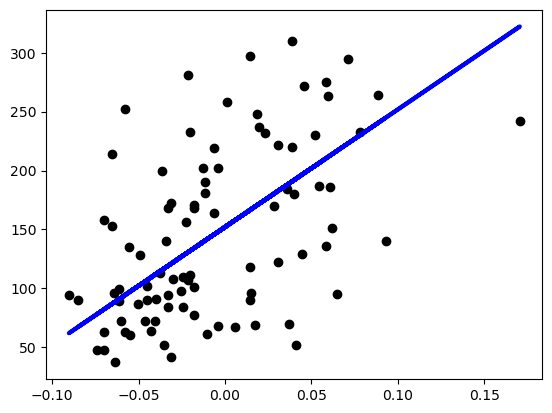
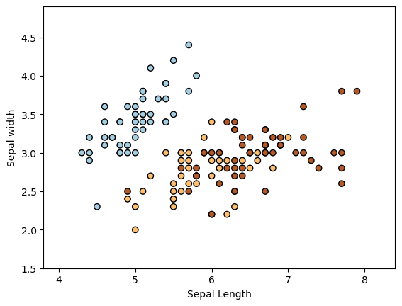

# ML-From-Scratch
- [ML-From-Scratch](#ml-from-scratch)
	- [Example](#example)
		- [Supervised Learning](#supervised-learning)
			- [Linear Regression](#linear-regression)
			- [Logistic Regression](#logistic-regression)
			- [Naive Bayes](#naive-bayes)
			- [Decision Tree](#decision-tree)

## Example
### Supervised Learning
#### Linear Regression
This model uses the diabetes dataset.


#### Logistic Regression
This model uses the iris dataset.


#### Naive Bayes
This model uses the iris.dataset.
```
(y_pred != test_y).sum()
1
```

#### Decision Tree